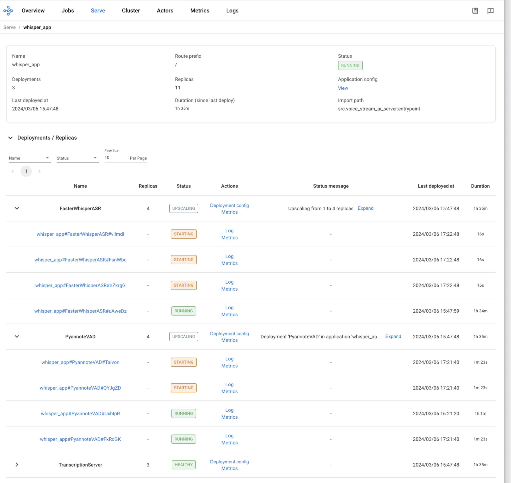
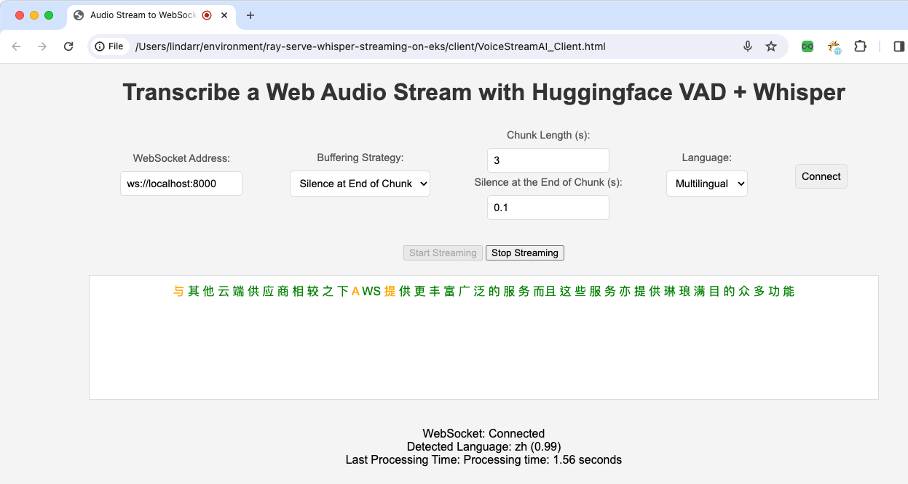
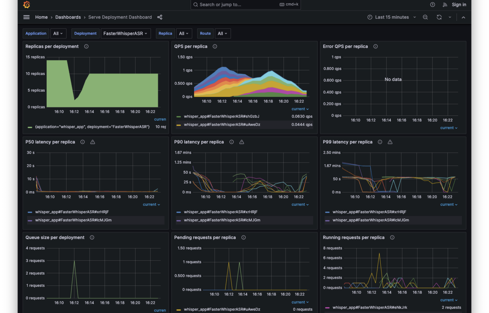

# Whisper Streaming with Ray Serve on Amazon EKS

[](https://opensource.org/licenses/MIT)

Whisper Streaming is a Ray Serve-based ASR solution that enables near-realtime audio streaming and transcription. The system employs Huggingface's Voice Activity Detection (VAD) and OpenAI's Whisper model (faster-whisper being the default) for accurate speech recognition and processing. 

The real-time streaming ASR can be used in the following use cases: 

* closed caption
* dictation, email, messaging
* dialogs systems
* front-end for online conference translation
* court protocols
* any sort of online transcription of microphone data

The project is based on VoiceStreamAI (https://github.com/alesaccoia/VoiceStreamAI). It is composed of containing multiple ML models (VAD and Whisper model) and buffering logic. I will apply the concept of Ray's [Deploy Compositions of Models](https://docs.ray.io/en/latest/serve/model_composition.html#compose-deployments-using-deploymenthandles) to independently scale and configure each of the ML models and business logic.

## Warning 

Ray is intended for use for strict controlled network only. It is strongly recommend that you should avoid expose the Ray Dashboard service or Ray Serve service to the Internet without proper authentication and control.    

## ⚠️ ⚠️ ⚠️ IMPORTANT ⚠️ ⚠️ ⚠️

It is necessary to request access for the model [pyannote/segmentation](https://huggingface.co/pyannote/segmentation) on Hugging Face. If you encounter errors for running the VAD deployment, double check that you have obtained the model access.  

## Setup

1. Before start, modify the variables in `dev.auto.tfvars`. Only `pyannote_auth_token` is mandatory, which is essentially a [Hugging Face](https://huggingface.co/) auth token.

```
cd infra/
cp tfvars-example dev.auto.tfvars
```

2. Set up EKS cluster, Karpenter and KubeRay helm chart, and NodePool and EC2NodeClass custom resource will be deployed. 

```
./install.sh
```

3. Deploy the KubeRay Service.
```
❯ kubectl apply -f ../Whisper-RayService.yaml
```

4. Check the Ray workers and Ray Serve deployments are ready:

```
# Check Ray workers are ready
❯ kubectl get pod
NAME                                                      READY   STATUS    RESTARTS       AGE
isper-streaming-raycluster-c2gdq-worker-gpu-group-6vxz5   1/1     Running   0              84m
whisper-streaming-raycluster-c2gdq-head-nxt2g             2/2     Running   0              98m

# Check RayService is ready 
❯ kubectl describe RayService whisper-streaming
Name:         whisper-streaming
Namespace:    default
API Version:  ray.io/v1
Kind:         RayService
Spec:
  ...
Status:

...
  Service Status:  Running

# Get the service names
❯ kubectl get svc
NAME                                          TYPE           CLUSTER-IP       EXTERNAL-IP                                                                         PORT(S)                                                   AGE
whisper-streaming-head-svc                    ClusterIP      172.20.146.174   <none>                                                                              10001/TCP,8265/TCP,52365/TCP,6379/TCP,8080/TCP,8000/TCP   5d5h
whisper-streaming-raycluster-c2gdq-head-svc   ClusterIP      172.20.89.123    <none>                                                                              10001/TCP,8265/TCP,52365/TCP,6379/TCP,8080/TCP,8000/TCP   98m
whisper-streaming-serve-svc                   ClusterIP      172.20.191.110   <none>                                                                              8000/TCP                                                  5d5h


```
## Test the Application

You can access the Ray Dashboard after port-forwarding 8265.
```
kubectl port-forward svc/whisper-streaming-head-svc 8265:8265
open http://localhost:8265 
```



The ASR service is exposed as a WebSocket service. You can port-forward the service 8000 and send live audio stream via a browser.

```
kubectl port-forward svc/whisper-streaming-serve-svc 8000:8000
open VoiceStreamAI_Client.html
```



## Load Testing

Simulate 20 audio streams with Locust using the command. With Ray Serve Autoscaler, you are able to serve ML models that scales out and in according to the request count automatically.  
```
❯ locust -u 20 --headless -f locustfile.py

[2024-03-15 12:52:36,101] bcd07456717e/INFO/locust.main: No run time limit set, use CTRL+C to interrupt
[2024-03-15 12:52:36,101] bcd07456717e/INFO/locust.main: Starting Locust 2.22.0
Type     Name                                                                          # reqs      # fails |    Avg     Min     Max    Med |   req/s  failures/s
--------|----------------------------------------------------------------------------|-------|-------------|-------|-------|-------|-------|--------|-----------
--------|----------------------------------------------------------------------------|-------|-------------|-------|-------|-------|-------|--------|-----------
         Aggregated                                                                         0     0(0.00%) |      0       0       0      0 |    0.00        0.00

[2024-03-15 12:52:36,101] bcd07456717e/INFO/locust.runners: Ramping to 20 users at a rate of 1.00 per second
[2024-03-15 12:52:36,228] bcd07456717e/INFO/root: Loading audio file
[2024-03-15 12:52:36,230] bcd07456717e/INFO/root: Start sending audio
[2024-03-15 12:52:37,280] bcd07456717e/INFO/root: Loading audio file
[2024-03-15 12:52:37,281] bcd07456717e/INFO/root: Start sending audio
Type     Name                                                                          # reqs      # fails |    Avg     Min     Max    Med |   req/s  failures/s
--------|----------------------------------------------------------------------------|-------|-------------|-------|-------|-------|-------|--------|-----------
[Send]   Audio trunks                                                                      10     0(0.00%) |    255     252     259    259 |    0.00        0.00
[Connect]  Websocket                                                                          2     0(0.00%) |    150     125     174    130 |    0.00        0.00
--------|----------------------------------------------------------------------------|-------|-------------|-------|-------|-------|-------|--------|-----------
         Aggregated                                                                        12     0(0.00%) |    238     125     259    250 |    0.00        0.00

[2024-03-15 12:52:38,235] bcd07456717e/INFO/root: Loading audio file
[2024-03-15 12:52:38,236] bcd07456717e/INFO/root: Start sending audio
[2024-03-15 12:52:39,247] bcd07456717e/INFO/root: Loading audio file
[2024-03-15 12:52:39,249] bcd07456717e/INFO/root: Start sending audio
[2024-03-15 12:52:39,830] bcd07456717e/INFO/root: {"language": "en", "language_probability": 0.94970703125, "text": "Good morning, everyone.", "words": [{"word": " Good", "start": 0.0, "end": 0.9, "probability": 0.93701171875}, {"word": " morning,", "start": 0.9, "end": 1.22, "probability": 0.9697265625}, {"word": " everyone.", "start": 1.34, "end": 1.7, "probability": 0.99462890625}], "processing_time": 0.4552152156829834}
Type     Name                                                                          # reqs      # fails |    Avg     Min     Max    Med |   req/s  failures/s
--------|----------------------------------------------------------------------------|-------|-------------|-------|-------|-------|-------|--------|-----------
[Send]   Audio trunks                                                                      36     0(0.00%) |    255     251     264    260 |    4.00        0.00
[Receive]  Response                                                                           1     0(0.00%) |      0       0       0      0 |    0.00        0.00
[Connect]  Websocket                                                                          4     0(0.00%) |    142     125     174    130 |    1.00        0.00
--------|----------------------------------------------------------------------------|-------|-------------|-------|-------|-------|-------|--------|-----------
         Aggregated                                                                        41     0(0.00%) |    238       0     264    260 |    5.00        0.00

[2024-03-15 12:52:40,238] bcd07456717e/INFO/root: Loading audio file
[2024-03-15 12:52:40,239] bcd07456717e/INFO/root: Start sending audio
[2024-03-15 12:52:40,856] bcd07456717e/INFO/root: {"language": "en", "language_probability": 0.94970703125, "text": "Good morning, everyone.", "words": [{"word": " Good", "start": 0.0, "end": 0.9, "probability": 0.93701171875}, {"word": " morning,", "start": 0.9, "end": 1.22, "probability": 0.9697265625}, {"word": " everyone.", "start": 1.34, "end": 1.7, "probability": 0.99462890625}], "processing_time": 0.45716142654418945}

```
## Observability

Follow the docs - [Using Prometheus and Grafana](https://docs.ray.io/en/latest/cluster/kubernetes/k8s-ecosystem/prometheus-grafana.html) to deploy Prometheus and Grafana to build Dashboard for Ray Cluster.



## Area of Improvement

1. [ASR Core] The latency is high because the audio is segmented by VAD or silence. In other words, the implementation is not real time yet. Refer to the [3. Create a Streaming ASR Demo with Transformers](https://www.gradio.app/guides/real-time-speech-recognition) for real time streaming ASR as future work.
2. [General] The code of testing are not modified / implemented.
3. [Cold Start] Store ML models on S3 storage instead of download from Internet 
4. [Cold Start] Pre-load ML container images in the data volume of Bottlerocket OS instead of downloading from ECR each time. 
5. [Cost] After ASR streaming is optimized, evaluate the performance and cost  

## License

This library is licensed under the MIT-0 License. See the LICENSE file.

